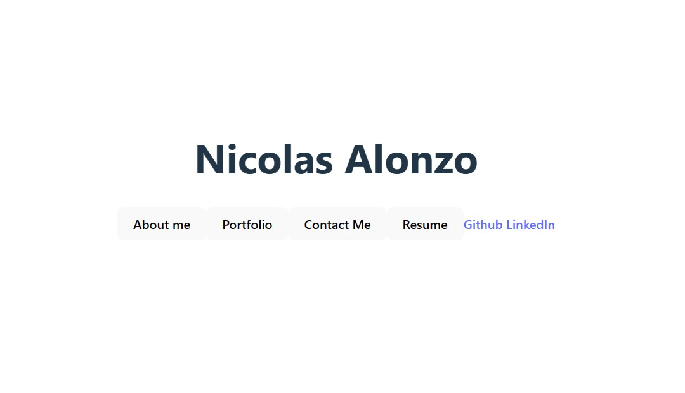
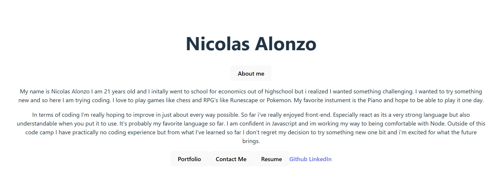
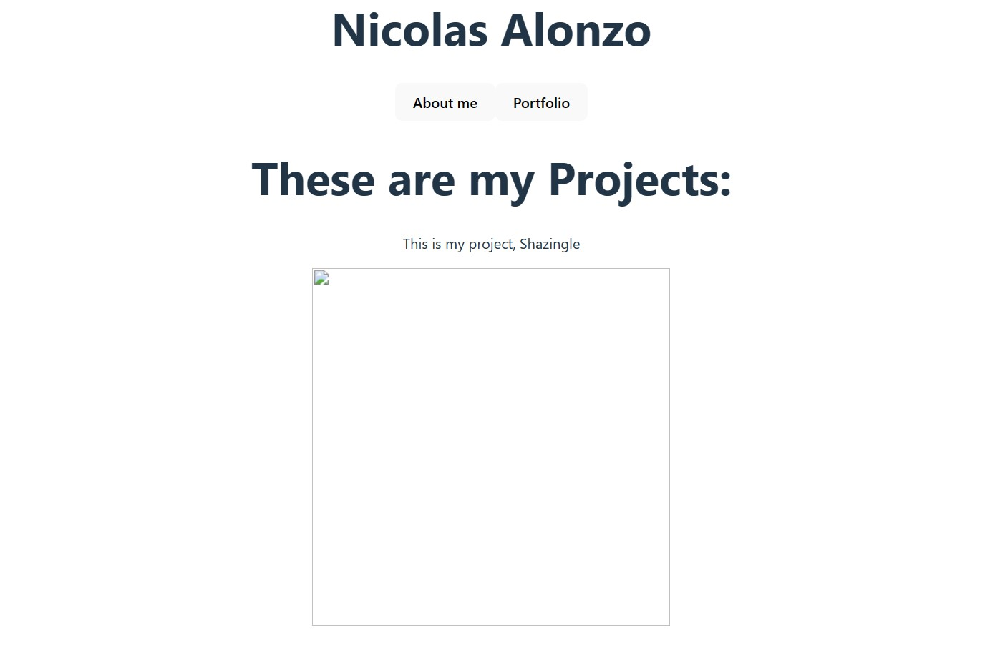
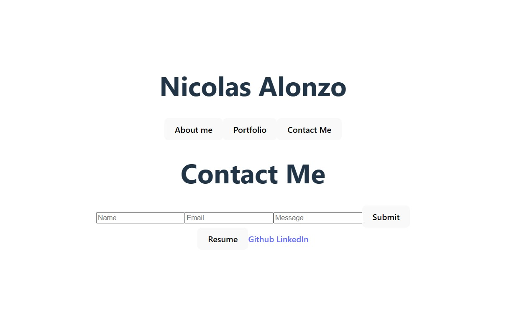

# React Professional Portfolio
  ## License:
  [License](https://img.shields.io/badge/license--blue.svg)
  ## Table of Contents
  - [Description](#description)
  - [Usage](#usage)
  - [Motivation](#motivation)
  - [Reason](#reason)
  - [Problem](#problem)
  - [Lessons](#lessons)
  - [Stand](#stand)
  - [Contact](#contact)
  - [Screenshots](#screenshots)
  - [Links](#links)

  ## Description:
  A react made portfolio to display your resume, previous works and a section about myself and a contact fill out to reach out to me.
  ## Usage:
  For the future when meeting with employers showing my skills in react and what i can do with them
  ## Motivation:
  I want to improve with react because i really enjoy react and want to get better.
  ## Reason:
  To be able to show off my own skills and have something to add to in the future.
  ## Problem:
  I found a lot of cool things about react and it refreshed my memory on react.
  ## Lessons:
  I learned how to display elements with the click of a button using 'useState' and how to itterate through an array of objects
  ## Stand:
  It shows my understanding of react so far and where I will improve and what i know so far.
  ## Contact
  - Github: [DewYourWorst] [(https://github.com/DewYourWorst)]
  - Email: [nicalonzo80@yahoo.com]
  ## Screenshots
  
  
  
  
  ## Links
  Live : https://stellular-snickerdoodle-9b6446.netlify.app/
  Github : https://github.com/DewYourWorst/React-Portfolio

